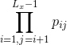
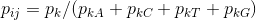

# README - Kmer.js
>A Javascript/NodeJS package for shredding strings into all possible substrings of length 'k'

  [![NPM Version][npm-image]][npm-url]
  [![NPM Downloads][downloads-image]][downloads-url]
  [![Linux Build][travis-image]][travis-url]
  [![Test Coverage][coveralls-image]][coveralls-url]
  
Kmer.js is a NodeJS package designed for data/science applications. It addresses the ['k-mer' problem](https://en.wikipedia.org/wiki/K-mer)(substrings of length from a string) in a simple and performant manner. This library produces all of the `n - k + 1` substrings of length `k` from a string of length `n`.

## Installation

OS X & Linux:

```sh
npm install --save kmer.js
```

## Usage Example

Loading the module and initiating a profile for a certain 'k'. An optional second argument string (e.g. 'ACTG') can be passed to specify the alphabet. Defaults to 'ACTG'. Protein alphabets can be used

```javascript
>var k = 3;
>var Kmer = require('kmer.js');
>var kmer = new Kmer(k); // Alphabet defaults to 'ACTG'
>//var kmer = new Kmer(k, "GALMFWKQESPVICYHRNDT");
{
  k: 2,
  alphabet: 'ACGT',
  notInAlphabet: /[^ACGT]/,
  letterToBinary: { A: 0, C: 1, G: 2, T: 3 },
  binaryToLetter: [ 'A', 'C', 'G', 'T' ],
  profile: Uint32Array [ 0, 0, 0, 0, 0, 0, 0, 0, 0, 0, 0, 0, 0, 0, 0, 0 ], // A null profile for the given k and alphabet.
}
```

Calculate all substrings for an arbitrary string

```javascript
>var fourmers = kmer.kmerArray("hello world!", 4)
[ 'hell',
'ello',
'llo ',
'lo w',
'o wo',
' wor',
'worl',
'orld',
'rld!' ]
```

Train the profile with an arbitrary fasta filestream

```javascript
>var fasta = require('bionode-fasta'); // Bionode-fastq is also usable
>var fs = require('fs');
>fs.createReadStream(filepath, {encoding: "UTF-8"})
 .pipe(fasta.obj())
 .pipe(kmer.streamingUpdate())
 .on('finish', function(){
    console.log("Done");
 });
>console.log(kmer.profile)
```

Train the profile with a Amazon AWS S3 stream

```javascript
>var AWS = require('aws-sdk');
>var s3 = new AWS.S3({apiVersion: '2006-03-01'});
>var fasta = require('bionode-fasta')
>var params = {Bucket: 'bucketname', Key: 'path/to/file.fasta'}
>s3.getObject(params).createReadStream()
 .pipe(fasta.obj())
 .pipe(kmer.streamingUpdate())
 .on('finish', function(){
     console.log("Done");
 });
>console.log(kmer.profile);
```

Get the count of a single kmer from the profile

```javascript
>let testKmer = "AAA" // Note that the length matches the value of k.
>let testIndex = kmer.sequenceToBinary(testKmer);
0
>kmer.profile[testIndex]
```

Get the sequence from a given binary-encoded index

```javascript
>let testIndex = 0
>kmer.binaryToSequence(testIndex);
'AAA'
```

Get the markov chain probability of a sequence, where L<sub>x</sub> is the length of the input sequence `x`, and p<sub>ij</sub> is the transition probability of the ith to jth kmer.





```
>let x = "ACTGACTTACGGATTGCATGACAT"
>p = kmer.probabilityOfSequence(x)
```


## Documentation

Check out the [Yuidoc documentation](https://matthewralston.github.io/kmer.js/docs), with examples and descriptions for all methods in the Kmer class.


## Development

```sh
npm test # MochaJS specs
npm run-script bench # benchmark.js performance tests, varying n and k
```

## License

Created by Matthew Ralston - [Scientist, Programmer, Musician](http://matthewralston.us) - [Email](mailto:mrals89@gmail.com)

Distributed under the GPL v3.0 license. See `LICENSE.txt` for the copy distributed with this project. Open source software is not for everyone, but for those of us starting out and trying to put the ecosystem ahead of ego, we march into the information age with this ethos.

[https://github.com/MatthewRalston/kmer.js](https://github.com/MatthewRalston/kmer.js)

## Contributing

1. Fork it (<https://github.com/MatthewRalston/kmer.js/fork>)
2. Create your feature branch (`git checkout -b feature/fooBar`)
3. Commit your changes (`git commit -am 'Add some fooBar'`)
4. Push to the branch (`git push origin feature/fooBar`)
5. Create a new Pull Request


[npm-image]: https://img.shields.io/npm/v/kmer.js.svg
[npm-url]: https://npmjs.org/package/kmer.js
[downloads-image]: https://img.shields.io/npm/dm/kmer.js.svg
[downloads-url]: https://npmjs.org/package/kmer.js
[travis-image]: https://img.shields.io/travis/MatthewRalston/kmer.js/master.svg?label=linux
[travis-url]: https://travis-ci.com/MatthewRalston/kmer.js
[coveralls-image]: https://img.shields.io/coveralls/MatthewRalston/kmer.js/master.svg
[coveralls-url]: https://coveralls.io/r/MatthewRalston/kmer.js?branch=master
